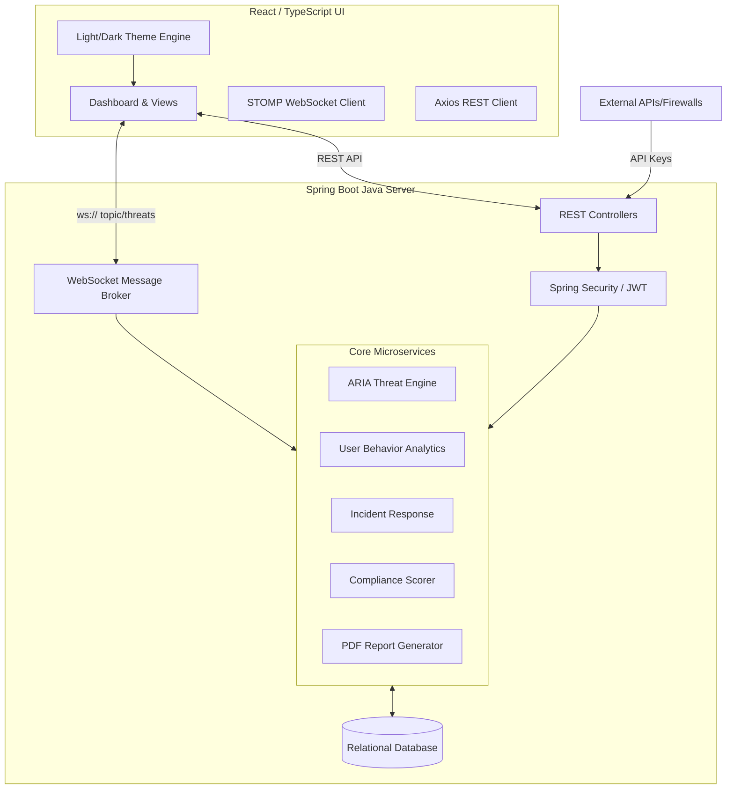

# 🛡️ SecureStream - Real-Time Threat Intelligence Engine

## 📖 Executive Summary
**SecureStream** is an enterprise-grade Security Information and Event Management (SIEM) and Threat Intelligence platform. It provides real-time monitoring, automated threat scoring via the ARIA engine, geospatial tracking, user behavior analytics (UBA), and interactive incident response capabilities. 

Built with a modern **React/TypeScript** frontend and a robust **Spring Boot** backend, it utilizes WebSockets for sub-second data delivery and active defense mechanisms.

---

## 🏗️ System Architecture



---

## ✨ Core Features & Modules

### 1. Identity & Access Management (RBAC)
*   **Secure Authentication:** Stateless JWT (JSON Web Token) based authentication.
*   **Role-Based Access Control:** Three distinct tiers:
    *   `ADMIN`: Full access (User management, API keys, system deletion).
    *   `ANALYST`: Operational access (Resolve threats, manage incidents, view maps).
    *   `VIEWER`: Read-only access (Dashboards, compliance, reports).
*   **User Management Dashboard:** Interactive grid with role assignment, account disabling, and secure deletion features.

### 2. Live Threat Dashboard & Global Map
*   **Real-Time Data Pipeline:** STOMP/WebSockets push threats to the UI instantly without polling.
*   **Geospatial Tracking:** Threats are mapped to their origin countries via Geo-IP coordinates.
*   **Actionable Alerts:** Analysts can instantly "Resolve" threats, automatically updating the centralized database and notifying other connected users.

### 3. ARIA Engine (AI Risk Intelligence Algorithm)
*   **Automated Threat Scoring:** Calculates an `ARIA Score` (0-100) based on severity, coordinated attack patterns, and historical data.
*   **IP Reputation Tracking:** Tracks repeat offenders. Automatically blacklists IPs that exceed critical threat thresholds.
*   **Live Intelligence Feed:** Streams real-time reputation updates and blocked IP lists to the frontend.

### 4. Incident Response (War Room)
*   **Kanban Board:** Drag-and-drop or click-to-move incident tracking (Open, Investigating, Mitigated, Closed).
*   **Interactive Playbooks:** Severity-specific playbooks (e.g., Isolate Asset, Block IP) with interactive checkboxes and progress bars.
*   **War Room Modal:** A responsive, scrollable deep-dive view into specific incidents.

### 5. User Behavior Analytics (UBA)
*   **Anomaly Detection:** Tracks login times, geographical access, and failed attempts.
*   **Off-Hours Alerts:** Flags users accessing the system outside standard corporate hours.
*   **Risk Scoring:** Assigns a behavioral risk score to internal employees.

### 6. API Integration Portal
*   **External Ingestion:** Generate secure `X-API-Key` credentials for external firewalls, AWS CloudTrail, or CrowdStrike to push data into SecureStream.
*   **Live Terminal:** A simulated command-line interface that lights up in real-time as external data flows into the system using the generated keys.

### 7. Compliance & Risk Dashboard
*   **Framework Mapping:** Real-time readiness scoring for **SOC2, ISO 27001, NIST CSF, and PCI-DSS**.
*   **Live Metrics:** Computes Threat Control, Incident Response, Audit Logging, and Access Control scores based on actual platform usage and database metrics.

### 8. Enterprise Reporting & Audit Logging
*   **Immutable Audit Trail:** Every action (Login, API Key Generation, Threat Resolution, Report Generation) is logged and viewable by Admins.
*   **PDF Generation:** The backend utilizes `OpenPDF` to compile colorful, branded, and heavily formatted Executive Summary PDFs available for instant download.

### 9. Premium User Experience (UX)
*   **Theme Engine:** Flawless Light Mode and Dark Mode palettes utilizing dynamic CSS variables.
*   **Portal Notifications:** Global, floating notification bell that catches live system events.
*   **Lucide Icons & Micro-interactions:** Hover effects, animated SVG rings, and toast notifications.

---

## 🚀 Setup & Deployment

### Default Credentials
| Role | Username | Password |
| :--- | :--- | :--- |
| **Admin** | `Musheer` | `Sm50738789@` |
| **Analyst** | `analyst_sec` | `Analyst123!` |
| **Viewer** | `viewer_audit` | `Viewer123!` |

### Running the Backend
```bash
cd "SecureStream -Backend/securestream"
# Ensure Java 17 is installed
./mvnw spring-boot:run
```
*Runs on `http://localhost:8080`*

### Running the Frontend
```bash
cd SecureStream-Frontend
npm install
npm run dev
```
*Runs on `http://localhost:5173`*

---

## 🔒 Final Status
The platform is currently in a **Feature-Complete (V1.0)** state. All core requirements for a modern SIEM (Data Ingestion, Threat Detection, Incident Response, Reporting, and Auditing) are fully implemented and functional.
